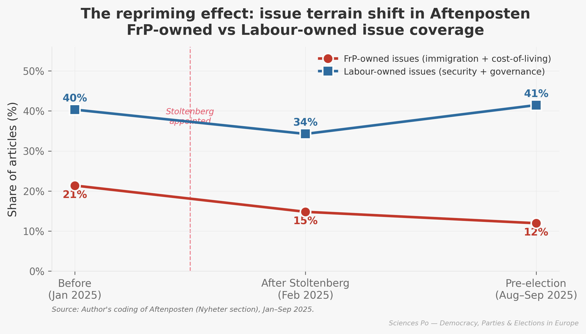

# Changing the Subject

Replication materials for the paper *Issue Priming, Valence Competition, and the Stoltenberg Effect in the 2025 Norwegian Parliamentary Election*.



This repository studies whether Jens Stoltenberg's appointment as Norway's finance minister on 4 February 2025 shifted the campaign agenda away from Progress Party-owned issues such as immigration and cost of living, and toward Labour-owned valence issues such as security, leadership, and competence.

> Main finding: the shift appears real, but gradual rather than immediate. FrP-owned issue coverage declines over the campaign, while Labour-owned themes remain dominant.

## What's here

- `paper/`: final paper in Typst, bibliography, and figures used in the manuscript.
- `code/src/dataset_cleaning.ipynb`: parses and validates the raw Aftenposten coding files.
- `code/src/analysis.ipynb`: builds the main tables, statistical tests, and publication figures.
- `code/src/google_trends.ipynb`: processes manually exported Google Trends data for Norway in 2025.
- `code/data/aftenposten/`: daily GPT-coded article files from Aftenposten.
- `code/data/output/`: cleaned datasets, tables, and figures used in the paper.
- `Changing the Subject : Issue Priming, Valence Competition and the Stoltenberg Effect in the 2025 Norwegian Parliamentary Election.pdf`: final paper.

## Workflow

1. Article texts from *Aftenposten* were collected manually through PressReader.
2. Each article was coded with a custom GPT-5.4 prompt for issue category, leader mentions, and tone toward Labour.
3. `dataset_cleaning.ipynb` turns those raw text files into analysis-ready CSVs.
4. `analysis.ipynb` generates the main figures and statistical tables.
5. `google_trends.ipynb` adds a supplementary public-attention measure from Google Trends exports.

## Reproducing the repository outputs

The project uses `uv`/Nix for the Python environment and notebooks for the analysis workflow.

```bash
uv sync
```

Then run the notebooks in `code/src/` in this order:

1. `dataset_cleaning.ipynb`
2. `analysis.ipynb`
3. `google_trends.ipynb`

Paper source lives in `paper/main.typ`. Compile it with a local Typst installation if needed.

## Data note

The Aftenposten material comes from manual archive collection, and Google Trends data is based on manual CSV exports saved in `code/data/google_trends/`. This means the repo is best understood as a transparent research workflow and replication archive, not a fully automated pipeline.
